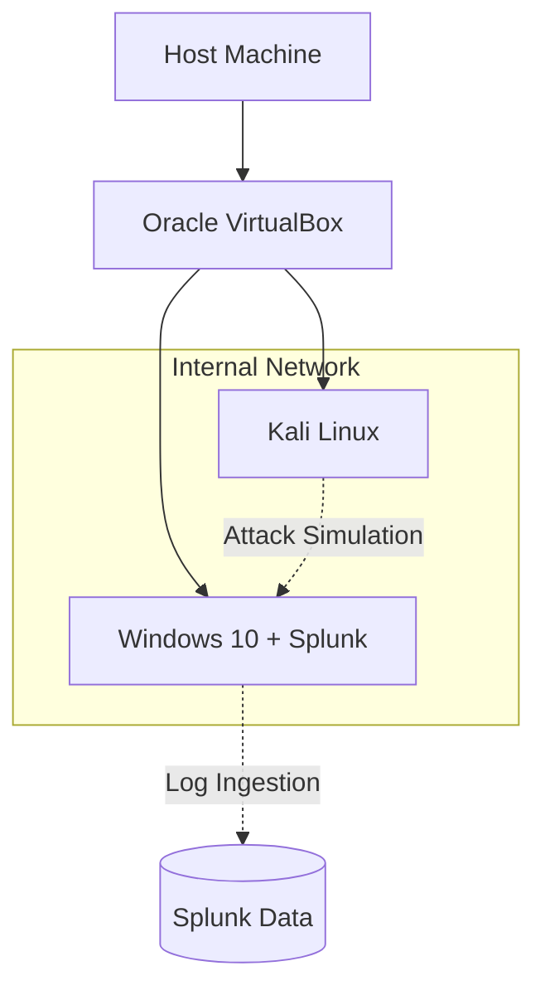

# 🛡️ VirtualBox Cybersecurity Home Lab: Kali Linux + Windows 10 + Splunk

> **A visually rich, hands-on cybersecurity lab** for practicing offensive and defensive skills. Learn virtualization, network segmentation, SIEM deployment, and security analysis — all in one elegant setup.

---

## ✨ Lab Overview

This project documents a **comprehensive home lab** using **Oracle VirtualBox**, featuring:

- **Windows 10 VM** – Simulating enterprise endpoints with security monitoring
- **Kali Linux VM** – Offensive testing and red teaming toolkit
- **Splunk Enterprise** – SIEM for monitoring, log analysis, and dashboard creation

The lab is designed to **enhance your resume**, **strengthen practical skills**, and **showcase your technical depth** on GitHub.

---

## 🏗️ Lab Architecture

### Host System Requirements
| Component | Minimum | Recommended |
|-----------|---------|-------------|
| **CPU** | 4 cores | 8+ cores |
| **RAM** | 8GB | 16GB+ |
| **Storage** | 80GB free | 100GB+ SSD |
| **Platform** | Windows 10/11, Linux, or macOS with [VirtualBox](https://www.virtualbox.org/) |

### Virtual Machine Specifications
| VM | RAM | vCPUs | Storage | Purpose |
|----|-----|-------|---------|---------|
| **Windows 10** | 4GB | 2 | 40GB | Splunk Enterprise + Endpoint Simulation |
| **Kali Linux** | 4GB | 2 | 20GB | Penetration Testing & Security Tools |

### Network Configuration
- **Internal Network** for isolated communication between VMs
- **NAT Adapter** (optional) for internet access and updates

### Visual Topology


---

## 🚀 Implementation Guide

### Step 1: VirtualBox Environment Setup
1. Install [Oracle VirtualBox](https://www.virtualbox.org/) and Extension Pack
2. Configure virtual networks in VirtualBox preferences
3. Create Windows 10 VM with recommended specifications
4. Create Kali Linux VM with offensive tools package selection

### Step 2: Windows 10 & Splunk Configuration
1. Complete Windows installation and security updates
2. Download and install [Splunk Enterprise](https://www.splunk.com/en_us/download/splunk-enterprise.html)
3. Deploy Sysmon for enhanced telemetry using SwiftOnSecurity configuration
4. Configure Splunk inputs for:
   - Windows Event Logs (Security, System, Application)
   - Sysmon operational logs
   - PowerShell transcription logs

### Step 3: Kali Linux & Attack Simulation
1. Connect both VMs to the same internal network
2. Verify connectivity with `ping` and `arp-scan`
3. Execute simulated attacks from Kali:
   ```bash
   # Network reconnaissance
   nmap -sV -O <target-IP>
   
   # Vulnerability scanning
   nikto -h http://<target-IP>
   
   # Brute force attempts
   hydra -l admin -P wordlist.txt <target-IP> http-form-post
   ```

### Step 4: Splunk Monitoring & Detection
Create detection searches for security monitoring:

```sql
# Failed authentication attempts
index=main sourcetype=WinEventLog:Security EventCode=4625 
| stats count by user, src_ip

# Network scanning detection
index=main sourcetype=sysmon EventID=3 
| stats count by DestinationIp, DestinationPort

# Suspicious process execution
index=main sourcetype=sysmon EventID=1 
| search Image="*powershell*" OR Image="*cmd*" 
| table _time, User, Image, CommandLine
```
---

## 🔍 Key Learning Objectives

- **Virtualization Proficiency**: Master isolated environment creation
- **Network Segmentation**: Implement secure communication channels
- **SIEM Deployment**: Configure enterprise-grade security monitoring
- **Th Detection**: Create alerts for malicious activity
- **Attack Simulation**: Practice ethical penetration techniques

---

## 📈 Future Enhancements

- [ ] **Active Directory Integration** for enterprise environment simulation
- [ ] **ELK Stack Implementation** for alternative SIEM experience
- [ ] **Wazuh Deployment** for integrated HIDS capabilities
- [ ] **Automated Threat Hunting** with Splunk ML Toolkit
- [ ] **Cloud Integration** for hybrid environment monitoring

---

## 👨‍💻 Author

**Naveen Singh**  
Cybersecurity Enthusiast | Forensics & Penetration Testing

> *This project demonstrates practical cybersecurity skills highly valued in industry roles. Fork, customize, and expand your own lab environment!*

---

<div align="center">

### 🎯 Lab Success Checklist
- [ ] VirtualBox environment configured
- [ ] Windows 10 VM with Splunk operational
- [ ] Kali Linux VM with tools installed
- [ ] Network connectivity established
- [ ] Log ingestion functioning
- [ ] Basic detection queries implemented
- [ ] Attack simulations performed

**⭐ Star this repository if you found it helpful!**

</div>
